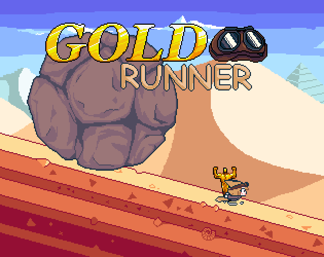

  

<h1 align="center">
  <a href="https://hyeonin.itch.io/goldrunner">🎮 게임 플레이 하러 가기 (itch.io)</a>
</h1>

---

# 🏃 프로젝트 소개
**Gold Runner**는 지난 2024년에 진행된 **[Mini Jam 166: Earth](https://itch.io/jam/mini-jam-166-earth)** 출품을 위해 개발되었던 캐주얼 러너 게임입니다.

> 본 저장소에 업로드된 소스 코드는 2024년 개발 당시의 코드가 아닙니다. 오픈소스 공개 및 아카이빙을 위해 2026년에 프로젝트를 처음부터 완전히 다시 작성한 재구현 버전이며, itch.io에 현재 배포된 빌드 또한 이 버전을 기반으로 합니다.

### 게임 시놉시스
황금 조각상을 손에 넣은 순간, 거대한 바위가 당신을 쫓기 시작합니다! 몰려오는 다양한 위협을 피해 최대한 멀리 달아나세요!

---

## 🎮 조작법
* **방향키:** 이동
* **Z:** 공격
* **X:** 점프

---

## 🛠️ 개발 세부사항
* **최초 출시:** 2024년 9월 (Mini Jam 166 제출)
* **코드 재구현:** 2026년 5월 
* **게임 엔진:** Godot Engine v4.6.2 *(2024년 최초 개발 당시 v4.3에서 마이그레이션)*
* **개발 언어:** GDScript
* **게임 아트:** Aseprite

---

## 👥 크레딧
* **[Hyeonin](https://linktr.ee/hyeonin):** 프로그래머
* **[OJIBI](https://x.com/o0000000000__):** 아티스트

---

## 📦 사용된 에셋
> 본 저장소 내의 효과음 및 음악 파일은 저작권 보호를 위해 무음 더미 파일로 대체되어 있습니다.

* **음악:** "Firebrand" by Kevin MacLeod ([incompetech.com](https://incompetech.com)), Licensed under Creative Commons: By [Attribution 4.0 License](http://creativecommons.org/licenses/by/4.0/).
* **효과음:** [Universal Sound FX](https://imphenzia.com/universal-sound-fx)
* **폰트:** [Galmuri](https://quiple.dev/font/galmuri), [Pixelroborobo](https://babaisyou531.wixsite.com/pixelroborobo)
* **플러그인:** [Aseprite Wizard](https://github.com/vinod8990/godot-aseprite-wizard) — Aseprite 애니메이션 임포트 도구 *(MIT License, `addons/` 폴더 내 포함)*

---

## 📜 라이선스
* **소스 코드:** **MIT License**에 따라 배포됩니다. 자세한 내용은 [LICENSE](LICENSE) 파일을 참조하십시오. (Copyright (c) 2026 Hyeon Lee(Hyeonin))
* **아트 에셋:** OJIBI가 제작한 모든 시각적 자료는 저작권으로 보호되며 **[Creative Commons Attribution 4.0 International (CC BY 4.0)](https://creativecommons.org/licenses/by/4.0/deed.ko)** 라이선스에 따라 사용할 수 있습니다.
* **게임 엔진:** 본 게임은 [Godot Engine](https://godotengine.org)을 사용하여 제작되었으며, 엔진 자체는 MIT License에 따라 제공됩니다. 상세한 엔진 라이선스 정보는 공식 [Godot Engine License 페이지](https://godotengine.org/license)에서 확인할 수 있습니다.